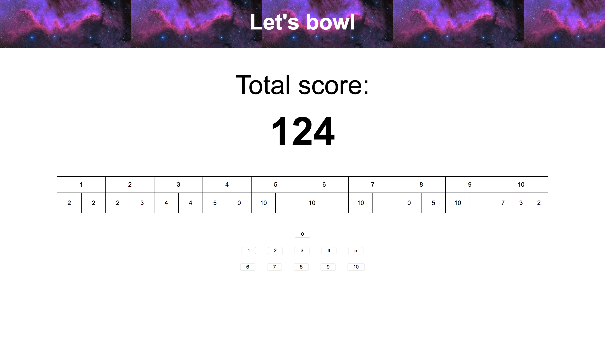
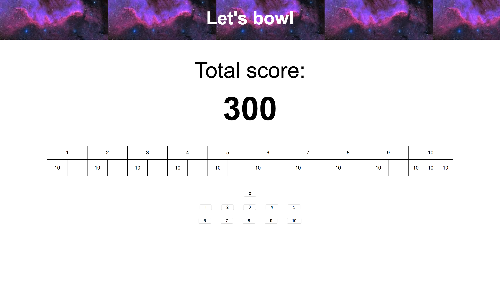

# Bowling Challenge

Completed this as fifth weekend challenge at Makers Academy

This program uses JavaScript to calculate the score of a bowling game. Use it to calculate your own bowling game here: https://lwkchan.github.io/bowling-challenge/

## How to use

1. Clone this repo.
2. In command line, change into project directory and run ```open index.html```

### To test code

Change into project directory and run ```open SpecRunner.html```

## The Task

Count and sum the scores of a bowling game for one player (in JavaScript).

A bowling game consists of 10 frames in which the player tries to knock down the 10 pins. In every frame the player can roll one or two times. The actual number depends on strikes and spares. The score of a frame is the number of knocked down pins plus bonuses for strikes and spares. After every frame the 10 pins are reset.

## My approach

1. Appreciating the complexity of the bowling scoring system, I spent a long time diagramming the 'bowlingGame' model, taking into account the bonuses allocated by strikes and spares.

2. These diagrams gave me the following key specifications:
      * A roll needs to add points to the total score
      * **Strikes** - The frame ends immediately. The bonus for that frame is the number of pins knocked down by the next two rolls.
      * **Spares** - The player has a spare if the knocks down all 10 pins with the two rolls of a frame. The bonus for that frame is the number of pins knocked down by the next roll (first roll of next frame).
      * **Tenth frame** - If the player rolls a strike or spare in the 10th frame they can roll the additional balls for the bonus. But they can never roll more than 3 balls in the 10th frame. The additional rolls only count for the bonus not for the regular frame count.
      * **Perfect Game** scores 300 points.
      * **Gutter Game** scores 0 points.

3. I implemented the features one-by-one, writing the necessary code to pass a feature test before moving on and implementing the next feature. In doing so, I ensured that no other specifications were affected by the addition of a new one.

4. After passing each feature test, I refactored the code to stick to DRY principles.

5. Having finished the model, I implemented a front-end with HTML and jQuery.

## Screenshots





## Key learnings

* Diagramming out complex models
  * I realised halfway through coding that I had diagrammed my original model incorrectly.  So with Git, I branched out a new master from an earlier commit. To see abandoned original model, run ```git checkout old-master```
* Refactoring JavaScript
* Implementing front-end animations with jQuery.

## To complete

* Finish off UI
* ~Finish off edge case of showing 'frame 11' on the html~

### Optional Extras

* Create a nice interactive animated interface with jQuery. *In progress*
* Set up Travis CI to run your tests.
* ~Add ESLint to your codebase and make your code conform.~
